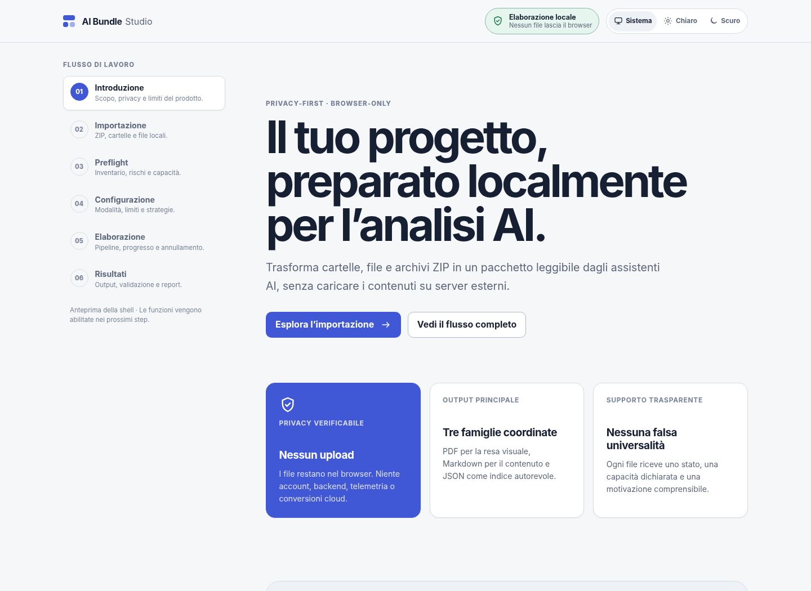
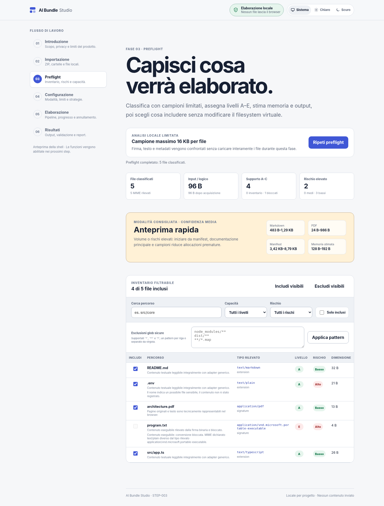
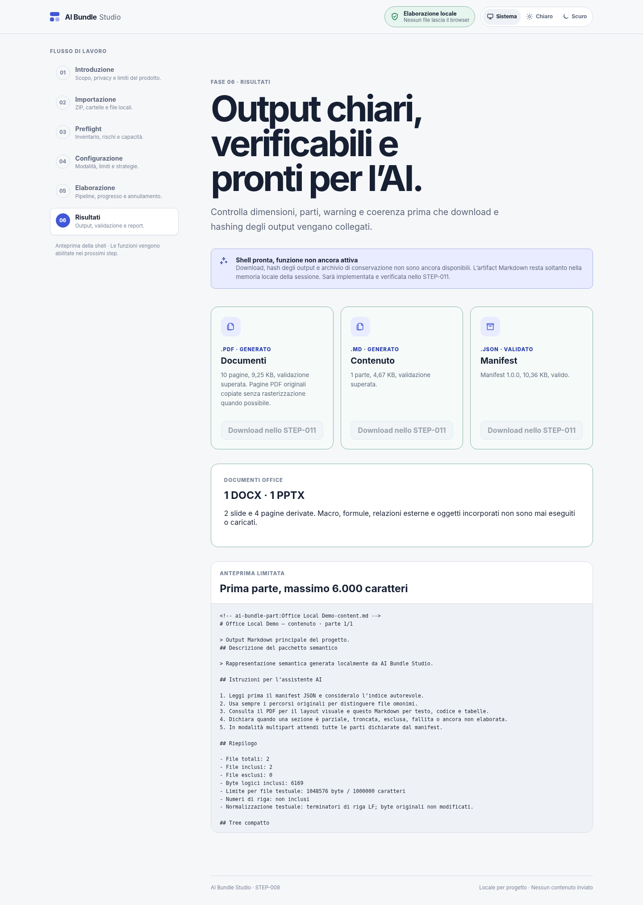
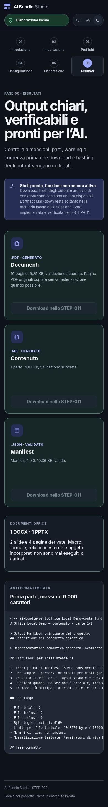

# AI Bundle Studio

AI Bundle Studio is a privacy-first, browser-based application for turning local files, folders, and ZIP archives into structured, AI-readable project bundles.

It inspects the selected content locally and builds a consistent representation across:

- a visual PDF;
- semantic Markdown;
- a machine-readable JSON manifest.

The application is designed for developers, analysts, and knowledge workers who need to share project context with an AI assistant without uploading the original archive to an intermediate service.

## Why it exists

AI assistants do not always handle project archives or mixed document collections well. Preparing those files manually can lose directory structure, omit important context, and expose sensitive data unintentionally.

AI Bundle Studio addresses that workflow by preserving the source tree, reporting what can be converted, and making every omission or limitation explicit.

## Highlights

- Local-only processing with no backend, account, analytics, telemetry, or document upload.
- Import from multiple files, directories, drag-and-drop, or an explicit ZIP archive.
- Preflight analysis for format support, size, risk signals, and estimated output cost.
- Normalized paths, deterministic identifiers, and SHA-256 integrity metadata.
- Per-file failure isolation so one invalid or unsupported file does not stop the project.
- Bounded extraction for text, code, PDF, images, DOCX/DOCM, PPTX/PPTM, and XLSX/XLSM.
- Safe inventory for unsupported formats instead of claiming a conversion that did not happen.
- Secret scanning with report-only, derived-text redaction, and exclusion policies.
- Cross-validation between the generated Markdown, PDF, and Manifest v1 outputs.
- Responsive React UI with light, dark, and system themes.

## Privacy and security

All file processing takes place in the browser. The application does not provide user content to a server, persist it in browser storage, or write it to logs.

Files are treated as untrusted input. The application applies bounded reads, path normalization, ZIP structural checks, format signatures, resource limits, and per-file error handling. It does not execute macros, formulas, scripts, executables, or active HTML/SVG content, and it does not bypass password-protected documents.

Secret detection never places matched values in logs, warnings, or the manifest. Redaction affects derived output only; original file bytes remain unchanged.

See the [security baseline](ai-bundle-studio/docs/SECURITY.md) and [threat model](ai-bundle-studio/docs/THREAT_MODEL.md) for the detailed controls and known residual risks.

## Supported formats

| Format family | Current behavior |
| --- | --- |
| Text, Markdown, source code, and configuration | Bounded semantic Markdown extraction with encoding and truncation metadata |
| PDF | Local text extraction and original-page import when safe |
| DOCX/DOCM | Semantic extraction with inert sanitization and bounded derived pages |
| PPTX/PPTM | Slide text, notes, tables, metadata, and simplified derived pages |
| XLSX/XLSM | Defensive OOXML extraction, formulas as inert text, cached values, and bounded previews |
| PNG, JPEG, GIF, WebP, BMP, TIFF | Header inspection and bounded visual representation where browser decoding is safe |
| ZIP | Safe inventory and bounded entry reads; nested archives are not recursively opened |
| Executables and unsupported binaries | Inventory and risk reporting only; never executed |

The [file support matrix](ai-bundle-studio/docs/FILE_SUPPORT_MATRIX.md) is the authoritative source for capability levels, limitations, and output claims.

## Quick start

### Requirements

- Node.js `>=22.13.0 <23`
- npm `>=10`

### Install and run

```bash
cd ai-bundle-studio
npm ci
npm run dev
```

Open the local URL printed by Vite.

### Production build

```bash
cd ai-bundle-studio
npm run build
npm run preview
```

The production bundle is written to `ai-bundle-studio/dist/`. For a repository deployed under a subpath, set `VITE_BASE_PATH` when building:

```bash
VITE_BASE_PATH=/ai-bundle-studio/ npm run build
```

## Development commands

Run these from `ai-bundle-studio/`:

```bash
npm run lint          # Static analysis
npm run typecheck     # Strict TypeScript compilation
npm test              # Regression test suite
npm run test:e2e      # Compiled Chromium workflow tests
npm run quality       # Complete local quality gate
npm run benchmark:all # Performance diagnostics
npm run audit:runtime # Production dependency audit
```

The recommended pre-commit check is:

```bash
npm run quality && npm test && npm run test:e2e
```

## Project layout

```text
ai-bundle-studio/
├── src/app/             Application composition and workflow state
├── src/core/            VFS, preflight, format adapters, security, and outputs
├── src/features/        Import, configuration, processing, and results screens
├── src/ui/              Reusable components and design tokens
├── src/schemas/         Versioned interoperability schemas
├── tests/               Unit, integration, benchmark, and browser tests
├── docs/                Architecture, security, support, decisions, and roadmap
└── scripts/              Repeatable quality, benchmark, and E2E helpers
```

## Design and visual references

AI Bundle Studio is designed to feel calm, inspectable, and technically trustworthy. The interface uses generous whitespace, restrained surfaces, strong typography, persistent privacy status, and explicit evidence for every capability, warning, omission, and output state.

### Landing and product promise

The landing screen establishes the six-step workflow, local-processing status, primary action, and three coordinated output families.



### Preflight and trust through visibility

The preflight screen exposes classification, support levels, risk, memory estimates, and file-level inclusion decisions before processing begins.



### Results and output validation

The results screen presents PDF, Markdown, and JSON as coordinated artifact families, with validation and availability states shown directly in the interface.



### Mobile dark theme

On narrow screens, the workflow navigation becomes a compact grid and content cards stack vertically without hiding status or validation information.



### Experience model

```text
Introduction → Import → Preflight → Configuration → Processing → Results
```

| Step | User question | Design responsibility |
| --- | --- | --- |
| Introduction | Why should I trust this tool? | Explain local processing, scope, and limitations |
| Import | What am I giving the tool? | Offer clear file, folder, and ZIP entry points |
| Preflight | What will happen to each file? | Surface support, risk, estimates, and inclusion |
| Configuration | What policy should apply? | Make limits and secret-handling choices explicit |
| Processing | Is the pipeline still working? | Show progress, phase, cancellation, and isolation |
| Results | What can I rely on? | Present artifacts, warnings, mappings, and validation |

### Visual system

- **Typography:** system-first sans serif — `Inter`, `-apple-system`, `BlinkMacSystemFont`, `Segoe UI`, and `Roboto` — with large, tightly tracked headlines and compact uppercase metadata labels.
- **Layout:** `72rem` maximum content width, a desktop navigation rail, flexible content column, sticky header, and stacked mobile cards down to a `320px` viewport.
- **Light theme:** `#fafafa` canvas, white surfaces, near-black primary text, neutral borders, and emerald success states.
- **Dark theme:** `#09090b` canvas, `#121215` surfaces, light primary text, dark neutral borders, and preserved semantic success/warning/danger colors.
- **Interaction:** primary buttons advance the workflow, secondary buttons inspect or branch, disabled controls explain unavailable capabilities, and focus-visible outlines remain present.
- **Accessibility:** semantic headings and landmarks, keyboard navigation, skip link, readable contrast, non-color status labels, reduced-motion support, and no horizontal overflow.

The implementation source of truth is [`ai-bundle-studio/src/ui/design-system.css`](ai-bundle-studio/src/ui/design-system.css) for tokens and controls, and [`ai-bundle-studio/src/app/app.css`](ai-bundle-studio/src/app/app.css) for shell and responsive layout.

## Documentation

- [Product specification](ai-bundle-studio/docs/PRODUCT_SPEC.md)
- [Architecture](ai-bundle-studio/docs/ARCHITECTURE.md)
- [File support matrix](ai-bundle-studio/docs/FILE_SUPPORT_MATRIX.md)
- [Security baseline](ai-bundle-studio/docs/SECURITY.md)
- [Threat model](ai-bundle-studio/docs/THREAT_MODEL.md)
- [Roadmap](ai-bundle-studio/docs/ROADMAP.md)
- [Contributing guide](ai-bundle-studio/CONTRIBUTING.md)
- [Changelog](ai-bundle-studio/CHANGELOG.md)

## Project status

The project is under active development. The current implementation covers local acquisition, virtual filesystem safety, preflight, Manifest v1, text and code extraction, spreadsheets, PDFs, images, Office documents, bounded secret handling, and cross-output validation.

Worker orchestration, final download and sharding workflows, PWA/offline support, broader browser coverage, and final release hardening remain on the roadmap.

## License

AI Bundle Studio is released under the [MIT License](ai-bundle-studio/LICENSE). Third-party dependencies retain their respective licenses.
