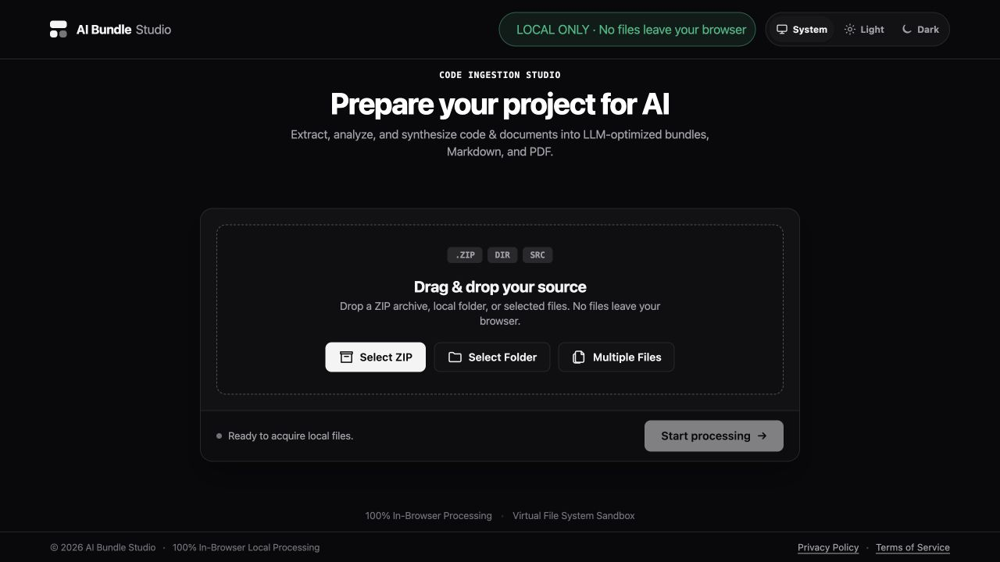
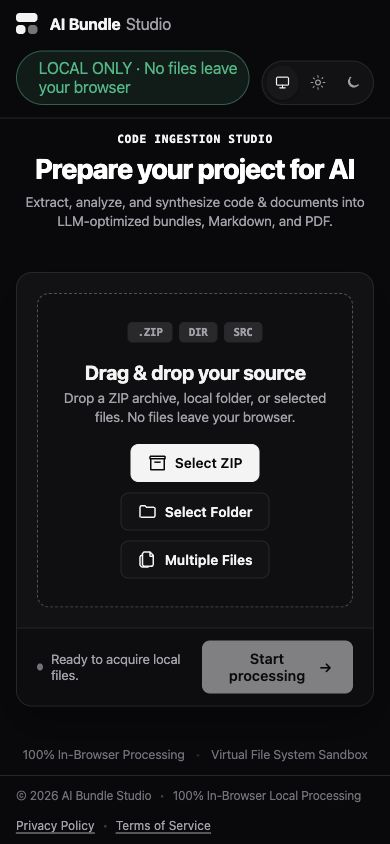
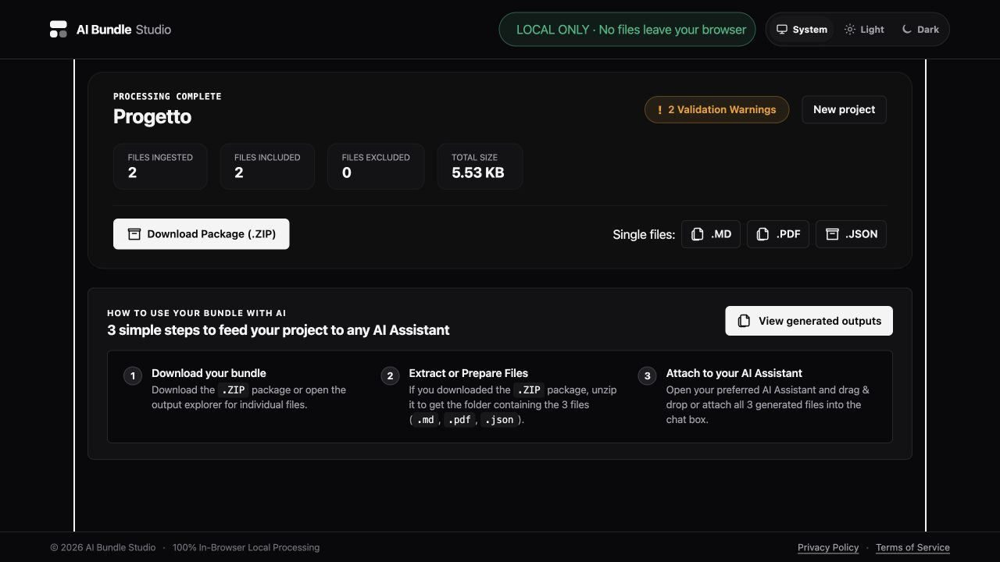
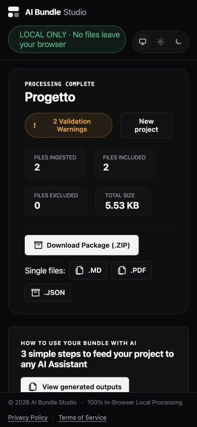

# AI Bundle Studio

AI Bundle Studio is a privacy-first, browser-based application for turning local files, folders, and ZIP archives into structured, AI-readable project bundles.

## Live demo

Use the published application here: **[https://pietro-crc.github.io/FILE-BUNDLE-Studio/](https://ai-bundle-studio.pcdev.workers.dev/)**

It inspects the selected content locally and builds a consistent representation across:

- a visual PDF;
- semantic Markdown;
- a machine-readable JSON manifest.

Some AI assistants limit a conversation to three or four file attachments. AI Bundle Studio converts an entire folder or repository into three coordinated files—a visual PDF, semantic Markdown, and JSON manifest—so you can share the complete project with your preferred AI assistant.

## Why it exists

AI assistants do not always handle project archives or mixed document collections well. Preparing those files manually can lose directory structure, omit important context, and expose sensitive data unintentionally.

AI Bundle Studio addresses that workflow by preserving the source tree, reporting what can be converted, and making every omission or limitation explicit.

## Highlights

- Local-only processing with no backend, account, analytics, telemetry, or document upload.
- Import from multiple files, directories, drag-and-drop, or an explicit ZIP archive.
- Preflight analysis for format support, size, risk signals, and estimated output cost.
- Normalized paths, deterministic identifiers, and SHA-256 integrity metadata.
- Per-file failure isolation so one invalid or unsupported file does not stop the project.
- Bounded extraction for text, code, PDF, images, DOCX/DOCM, PPTX/PPTM, and XLSX/XLSM.
- Safe inventory for unsupported formats instead of claiming a conversion that did not happen.
- Secret scanning with report-only, derived-text redaction, and exclusion policies.
- Cross-validation between the generated Markdown, PDF, and Manifest v1 outputs.
- Responsive React UI with light, dark, and system themes.

## Privacy and security

AI Bundle Studio is engineered under a strict **Zero-Trust, Local-Only Security Model**.

### 🔒 Core Security Pillars

- **100% In-Browser Execution:** All file extraction, parsing, secret scanning, and document generation execute locally inside your browser engine. No files, code, or metadata ever leave your machine.
- **Zero Telemetry & Zero Persistence:** No remote servers, backend APIs, analytics, tracking cookies, or browser storage persistence (`localStorage`/`IndexedDB`). Data exists solely in temporary memory while processing.
- **Inert Processing & Defense-in-Depth:** Files are treated as untrusted input. Executables, Office macros, VBA scripts, spreadsheet formulas, and active HTML/SVG elements are never executed or rendered as live code.
- **Defensive Resource Bounding:** Strict memory, file size, entry count, path depth, and decompression ratio ceilings protect against ZIP bombs, path traversal, and browser memory exhaustion.
- **Secret Detection & Redaction:** Built-in scanner identifies private keys, API tokens, JWTs, and connection strings. Redaction applies strictly to generated derived outputs—your original source files are never mutated.

For complete controls, vulnerability policies, and risk mitigations, review the [Security Baseline](docs/SECURITY.md) and [Threat Model](docs/THREAT_MODEL.md).

## Supported formats

| Format family | Current behavior |
| --- | --- |
| Text, Markdown, source code, and configuration | Bounded semantic Markdown extraction with encoding and truncation metadata |
| PDF | Local text extraction and original-page import when safe |
| DOCX/DOCM | Semantic extraction with inert sanitization and bounded derived pages |
| PPTX/PPTM | Slide text, notes, tables, metadata, and simplified derived pages |
| XLSX/XLSM | Defensive OOXML extraction, formulas as inert text, cached values, and bounded previews |
| PNG, JPEG, GIF, WebP, BMP, TIFF | Header inspection and bounded visual representation where browser decoding is safe |
| ZIP | Safe inventory and bounded entry reads; nested archives are not recursively opened |
| Executables and unsupported binaries | Inventory and risk reporting only; never executed |

The [file support matrix](docs/FILE_SUPPORT_MATRIX.md) is the authoritative source for capability levels, limitations, and output claims.

## Quick start

### Requirements

- Node.js `>=22.13.0 <23`
- npm `>=10`

### Install and run

```bash
npm ci
npm run dev
```

Open the local URL printed by Vite.

### Production build

```bash
npm run build
npm run preview
```

The production bundle is written to `dist/`. For a repository deployed under a subpath, set `VITE_BASE_PATH` when building:

```bash
VITE_BASE_PATH=/ai-bundle-studio/ npm run build
```

## Development commands

Run these from the repository root:

```bash
npm run lint          # Static analysis
npm run typecheck     # Strict TypeScript compilation
npm test              # Regression test suite
npm run test:e2e      # Compiled Chromium workflow tests
npm run quality       # Complete local quality gate
npm run benchmark:all # Performance diagnostics
npm run audit:runtime # Production dependency audit
```

The recommended pre-commit check is:

```bash
npm run quality && npm test && npm run test:e2e
```

## Project layout

```text
src/app/                 Application composition and workflow state
src/core/                VFS, preflight, format adapters, security, and outputs
src/features/            Import, configuration, processing, and results screens
src/ui/                  Reusable components and design tokens
src/schemas/             Versioned interoperability schemas
tests/                   Unit, integration, benchmark, and browser tests
docs/                    Architecture, security, support, decisions, and roadmap
scripts/                 Repeatable quality, benchmark, and E2E helpers
```

## Design and visual references

AI Bundle Studio is designed to feel calm, inspectable, and technically trustworthy. The interface uses generous whitespace, restrained surfaces, strong typography, persistent privacy status, and explicit evidence for every capability, warning, omission, and output state.

The following screenshots are fresh captures from the current compiled application. They are kept in `docs/screenshots/` and should be refreshed when a major visual change lands.

### Current landing and acquisition

The current landing screen establishes the local-processing status, source acquisition actions, and in-browser processing promise.



### Current mobile acquisition layout

The acquisition workspace remains usable on a narrow viewport: the privacy status stays visible, source actions stack cleanly, and processing remains clearly disabled until a project is ready.



### Current results and output delivery

The current results screen presents the generated package, validation warnings, individual output formats, and usage instructions for attaching the bundle to an AI assistant.



### Current mobile results layout

On narrow screens, the current result cards stack vertically while keeping download actions, warnings, and privacy status visible.



### Experience model

```text
Acquire source → Process locally → Deliver outputs
```

| Phase | User question | Design responsibility |
| --- | --- | --- |
| Acquire source | What am I giving the tool? | Offer clear ZIP, folder, and multiple-file entry points |
| Process locally | Is the pipeline safe and still working? | Show local status, progress, cancellation, limits, and isolation |
| Deliver outputs | What can I rely on? | Present the package, formats, warnings, instructions, and validation |

### Visual system

- **Typography:** system-first sans serif — `Inter`, `-apple-system`, `BlinkMacSystemFont`, `Segoe UI`, and `Roboto` — with large, tightly tracked headlines and compact uppercase metadata labels.
- **Layout:** centered studio workspace card, persistent header controls, clear processing/result surfaces, and stacked mobile cards down to a `320px` viewport.
- **Light theme:** `#fafafa` canvas, white surfaces, near-black primary text, neutral borders, and emerald success states.
- **Dark theme:** `#09090b` canvas, `#121215` surfaces, light primary text, dark neutral borders, and preserved semantic success/warning/danger colors.
- **Interaction:** primary buttons advance the workflow, secondary buttons inspect or branch, disabled controls explain unavailable capabilities, and focus-visible outlines remain present.
- **Accessibility:** semantic headings and landmarks, keyboard navigation, skip link, readable contrast, non-color status labels, reduced-motion support, and no horizontal overflow.

The implementation source of truth is [`src/ui/design-system.css`](src/ui/design-system.css) for tokens and controls, and [`src/app/app.css`](src/app/app.css) for shell and responsive layout.

## Contributing

Contributions are welcome! Please read our [Contributing Guide](CONTRIBUTING.md) for detailed instructions on local development, architectural principles, code conventions, and mandatory quality gates.

### Pre-commit Quality Gate

Before opening a pull request, run the complete local quality gate:

```bash
npm run quality && npm test && npm run test:e2e
```

## Documentation

- [Product specification](docs/PRODUCT_SPEC.md)
- [Architecture](docs/ARCHITECTURE.md)
- [File support matrix](docs/FILE_SUPPORT_MATRIX.md)
- [Security baseline](docs/SECURITY.md)
- [Threat model](docs/THREAT_MODEL.md)
- [Roadmap](docs/ROADMAP.md)
- [Contributing guide](CONTRIBUTING.md)
- [Changelog](CHANGELOG.md)

## Project status

The project is under active development. The current implementation covers local acquisition, virtual filesystem safety, preflight, Manifest v1, text and code extraction, spreadsheets, PDFs, images, Office documents, bounded secret handling, and cross-output validation.

Worker orchestration, final download and sharding workflows, PWA/offline support, broader browser coverage, and final release hardening remain on the roadmap.

## License

AI Bundle Studio is released under the [MIT License](LICENSE). Third-party dependencies retain their respective licenses.
